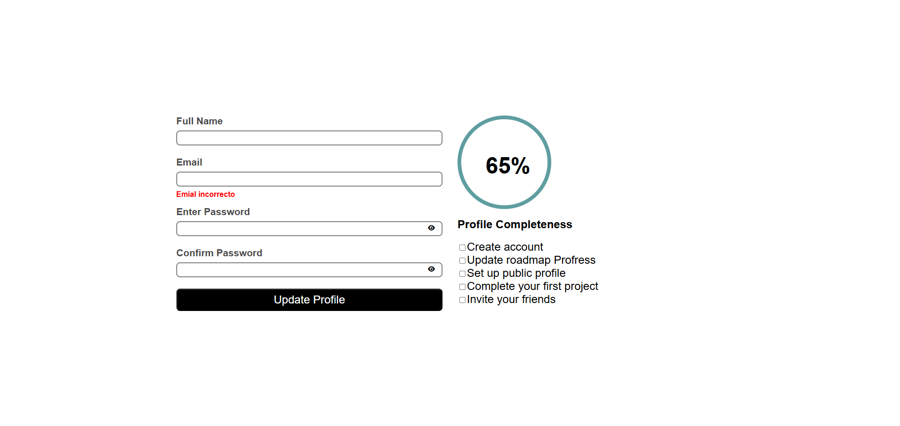

# roadmap_frontend_accesibleFormUI
## 🧾 Proyecto: Formulario UI Accesible (Solo HTML y CSS)
En este proyecto, diseño una interfaz de formulario utilizando únicamente HTML y CSS. El formulario incluye campos para:

Nombre completo

Correo electrónico

Contraseña

Confirmación de contraseña

Además, cuenta con un botón para mostrar u ocultar el texto de la contraseña, una barra de progreso que indica el nivel de completitud del formulario, y una lista de requisitos que deben cumplirse para alcanzar el 100%.

Este formulario no es funcional por ahora; se trata de un componente UI estático que podrá mejorarse más adelante con JavaScript.

### 🎯 Objetivo del proyecto
El propósito principal es practicar HTML, CSS y enfocarme en la creación de un formulario que sea accesible para todos los usuarios, incluyendo personas con discapacidades.

